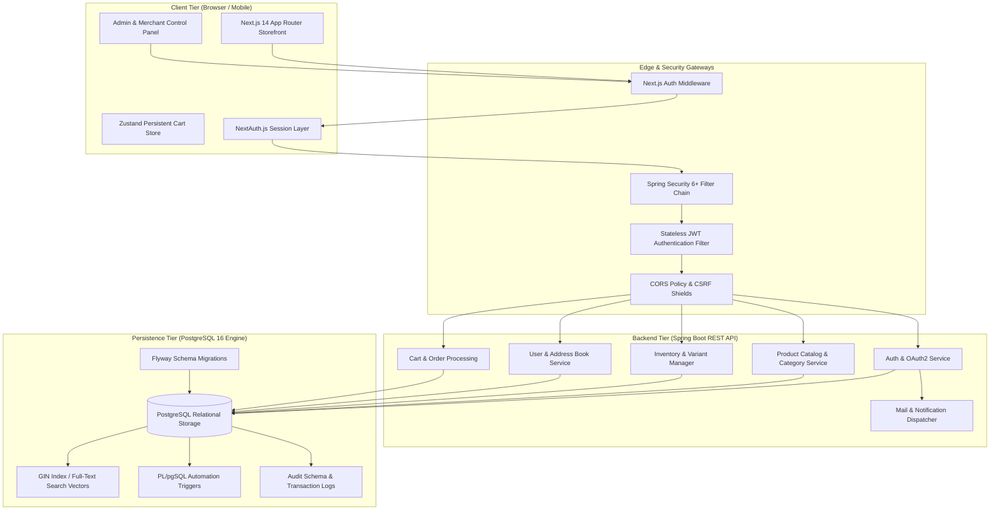

# 🛒 ShopForge — Enterprise Full-Stack E-Commerce Platform

[](https://openjdk.org/)
[](https://spring.io/projects/spring-boot)
[](https://www.postgresql.org/)
[-black?style=for-the-badge&logo=next.js&logoColor=white)](https://nextjs.org/)
[](https://www.typescriptlang.org/)
[](https://tailwindcss.com/)
[](LICENSE)

---

## 📌 Executive Summary

**ShopForge** is a modern, enterprise-grade, full-featured B2C e-commerce platform engineered with a decoupled, high-performance architecture. It unites a robust **Spring Boot** REST API backend with an intuitive, dynamic **Next.js 14 App Router** frontend, backed by a production-tuned **PostgreSQL** database.

ShopForge is designed with industry standards in mind: strict **Role-Based Access Control (RBAC)**, stateless **JWT authentication with cryptographic token rotation**, Google OAuth2 token exchange, automated PostgreSQL full-text search indexing, multi-variant inventory management, dynamic cart and checkout flows, and a dedicated multi-tab Merchant/Admin control center.

---

## 📑 Table of Contents

- [Architectural Overview](#-architectural-overview)
- [Monorepo Directory Structure](#-monorepo-directory-structure)
- [Technology Stack](#-technology-stack)
- [Key Features & Capabilities](#-key-features--capabilities)
  - [1. Customer Storefront](#1-customer-storefront)
  - [2. Authentication & Security Engine](#2-authentication--security-engine)
  - [3. Customer Account Portal](#3-customer-account-portal)
  - [4. Merchant & Admin Control Center](#4-merchant--admin-control-center)
  - [5. Database Automation & Triggers](#5-database-automation--triggers)
- [Database Architecture & Data Models](#-database-architecture--data-models)
- [Default Seeded Credentials](#-default-seeded-credentials)
- [Step-by-Step Installation & Setup](#-step-by-step-installation--setup)
  - [Prerequisites](#prerequisites)
  - [1. Database Configuration](#1-database-configuration)
  - [2. Backend Setup (Spring Boot)](#2-backend-setup-spring-boot)
  - [3. Frontend Setup (Next.js)](#3-frontend-setup-nextjs)
- [Environment Variables Reference](#-environment-variables-reference)
- [REST API Reference & Documentation](#-rest-api-reference--documentation)
- [Testing & Quality Assurance](#-testing--quality-assurance)
- [Project Roadmap & Sprint Milestones](#-project-roadmap--sprint-milestones)
- [Contributing & License](#-contributing--license)

---

## 🏗️ Architectural Overview

The platform uses a layered, decoupled client-server architecture. The frontend handles server-side rendering (SSR), client-side interactivity, and caching via TanStack Query and Zustand. The backend enforces business rules, transactional boundaries, data sanitization, and security filters.



---

## 📂 Monorepo Directory Structure

```plaintext
shopforge/
├── docs/                                  # Architectural specifications & requirements
│   ├── 01_SRS_ShopForge.pdf               # Software Requirements Specification (SRS)
│   ├── 02_DB_Design_ShopForge.pdf         # Entity-Relationship & Database Schema Design
│   └── 03_Dev_Guide_ShopForge.pdf         # 8-Sprint Step-by-Step Senior Roadmap
│
├── shopforge/                             # Spring Boot REST API Backend
│   ├── mvnw / mvnw.cmd                    # Maven wrapper binaries
│   ├── pom.xml                            # Spring Boot & Java dependency manifest
│   └── src/
│       ├── main/
│       │   ├── java/com/codewithalanso/shopforge/
│       │   │   ├── ShopforgeApplication.java
│       │   │   ├── auth/                  # Authentication & OAuth2 core
│       │   │   │   ├── controller/        # AuthController (register, login, refresh, recovery)
│       │   │   │   ├── dto/               # Auth & catalog Data Transfer Objects
│       │   │   │   ├── security/          # JwtFilter, JwtUtil, CustomUserDetails
│       │   │   │   └── service/           # AuthService, GoogleTokenVerifier, UserService
│       │   │   ├── common/                # Shared exceptions & standardized ApiResponse envelope
│       │   │   ├── config/                # SecurityConfig, CORS, SeedDataRunner
│       │   │   ├── controllers/           # CategoryController, ProductController, UserController
│       │   │   ├── entities/              # 20+ JPA Entities (Product, Variant, Order, etc.)
│       │   │   ├── repositories/          # Spring Data JPA interfaces
│       │   │   └── services/              # ProductService, CategoryService, EmailService
│       │   └── resources/
│       │       ├── application.properties # Server, database, JWT, and SMTP configurations
│       │       └── db/migration/          # Flyway SQL migration scripts (V1, V2)
│       └── test/                          # Unit & integration testing suites
│           └── java/.../auth/             # AuthIntegrationTest (Spring Boot Test Runner)
│
└── shopforge-frontend/                    # Next.js 14 Frontend Application
    ├── package.json                       # Dependencies (Next.js, Tailwind, NextAuth, Zustand)
    ├── tsconfig.json                      # Strict TypeScript compiler options
    ├── tailwind.config.ts                 # Design tokens, color system, and layout plugins
    └── src/
        ├── middleware.ts                  # Edge authorization middleware (Admin & Account guards)
        ├── app/
        │   ├── (auth)/                    # Login & Register route group
        │   ├── (storefront)/              # Public e-commerce browsing routes
        │   │   ├── c/[slug]/              # Category listing pages
        │   │   ├── p/[slug]/              # Product detail pages (PDP) with variant picker
        │   │   ├── cart/                  # Dedicated cart overview page
        │   │   ├── checkout/              # Multi-step checkout with address & payment selection
        │   │   └── search/                # Dynamic search discovery with facet filters
        │   ├── account/                   # Authenticated customer portal (Orders, Addresses, Security)
        │   ├── admin/                     # Multi-tab Merchant/Admin dashboard (Analytics, Inventory)
        │   ├── layout.tsx                 # Root layout with providers (QueryClient, Toaster)
        │   └── page.tsx                   # High-converting Storefront homepage
        ├── components/
        │   ├── cart/                      # Slide-over CartDrawer, CartItemRow, OrderSummary
        │   ├── catalog/                   # ProductCard, VariantSelector, FilterSidebar
        │   ├── home/                      # HeroBanner, CategoryGrid, FlashSaleSection, TrustBadges
        │   ├── layout/                    # Responsive Navbar, MegaMenu, Footer, Mobile BottomNav
        │   └── ui/                        # Reusable primitives (Buttons, Badges, Modals, Inputs)
        ├── lib/
        │   ├── api/                       # Typed Axios HTTP clients (auth, products, users)
        │   └── utils.ts                   # Class merging (`clsx` + `tailwind-merge`), formatters
        └── store/
            ├── cartStore.ts               # Zustand store with persistent client storage
            └── uiStore.ts                 # Modal toggles, search drawers, navigation state
```

---

## 💻 Technology Stack

### Backend Core & Services
| Component | Technology | Version | Purpose |
| :--- | :--- | :--- | :--- |
| **Runtime & Language** | Java (OpenJDK) | 21 / 25 | High-performance enterprise backend runtime |
| **Framework** | Spring Boot | 3.2+ / 4.1.0 | REST API layer, dependency injection & lifecycle |
| **ORM / Data Access** | Spring Data JPA / Hibernate | 6.x / 7.x | Object-relational mapping, batching & transactions |
| **Database Migration**| Flyway | Latest | Version-controlled, idempotent SQL schema evolution |
| **Security** | Spring Security | 6.x | Stateless filter chain, RBAC, method security |
| **Token Handling** | `io.jsonwebtoken` (JJWT) | 0.12.5 | Cryptographic JWT access & refresh token signing |
| **Email Delivery** | Spring Starter Mail | Latest | SMTP verification codes and password recovery links |
| **Connection Pooling**| HikariCP | Built-in | Production-tuned high-concurrency database connection pool |
| **Boilerplate Reduction**| Project Lombok | 1.18.46 | Clean builder patterns, getters, and constructor injection |

### Frontend & UI Architecture
| Component | Technology | Version | Purpose |
| :--- | :--- | :--- | :--- |
| **Framework** | Next.js (App Router) | 14.2.35 | Server-side rendering (SSR), route groups, streaming |
| **Language** | TypeScript | 5.x | End-to-end type safety across DTOs and UI state |
| **Styling & Design** | Tailwind CSS | 3.4.1 | Utility-first responsive design tokens |
| **Authentication** | NextAuth.js | 4.24.14 | Session persistence, OAuth token exchange, JWT sync |
| **Client State** | Zustand | 5.0.14 | Lightweight, persistent cart and UI modal store |
| **Server State** | TanStack React Query | 5.101.1 | Asynchronous caching, query invalidation, and re-fetching |
| **Form Management** | React Hook Form + Zod | 7.80 / 4.4 | Declarative validation with schema validation |
| **Icons & Feedback** | Lucide React + Hot Toast | Latest | Modern iconography and toast notifications |

### Database & Persistence Engine
| Technology | Details |
| :--- | :--- |
| **PostgreSQL 16+** | Relational core storing Users, Products, Variants, Carts, Orders, and Audits |
| **Custom PostgreSQL ENUMs** | `user_status`, `user_role`, `product_status`, `order_status`, `payment_status`, `coupon_type`, `review_status`, `inv_txn_type` |
| **Full-Text Search Engine** | Native PostgreSQL `tsvector` with `GIN` index and automated trigger updates |
| **Audit Schema** | Dedicated `audit.audit_logs` table tracking record mutations with JSONB snapshots |

---

## ⚡ Key Features & Capabilities

### 1. Customer Storefront
* **Dynamic Hero & Flash Sale Sections:** Banner sliders, countdown timers for discounted items, and category spotlight cards.
* **Hierarchical Category Exploration:** Recursive category trees supporting multi-level navigation (e.g., Electronics → Audio → Headphones).
* **Multi-Facet Search & Filter:** Instant search modal alongside a dedicated `/search` engine filtering by price bounds, brand, minimum star rating, and in-stock status.
* **Product Detail Page (PDP):** Interactive variant selector (dynamically adjusting SKU, pricing, and stock status), image galleries, and structured markdown descriptions.
* **Frictionless Cart & Drawer:** Slide-over cart drawer allowing quantity increments, variant changes, and real-time subtotal/tax calculation.
* **Multi-Step Checkout:** Address selection/creation, shipping method selection, coupon application, and order placement.

### 2. Authentication & Security Engine
* **Hybrid Authentication Flow:** Traditional email/password registration with BCrypt hashing (strength 12) + Google OAuth2 ID token exchange.
* **Token Rotation Pattern:**
  * **Access Token:** Short-lived (15 minutes) for low-exposure stateless API calls.
  * **Refresh Token:** Long-lived (7 days), hashed in the database, cryptographically rotated upon every refresh cycle.
* **Brute-Force & Lockout Protection:** Automated counter tracking failed login attempts; locks account access once threshold is crossed.
* **Account Recovery & Verification:** Time-sensitive reset tokens generated via `password_reset_tokens` table and dispatched via SMTP email.
* **Role-Based Access Control:** Strict authorization across 4 distinct roles: `CUSTOMER`, `SELLER`, `ADMIN`, `SUPPORT`.

### 3. Customer Account Portal
* **Profile Management:** Update personal details, first/last names, phone numbers, and profile avatars.
* **Address Book:** Create, edit, and designate default shipping and billing addresses.
* **Order History & Tracking:** View placed orders with real-time status progressions (`PENDING` → `PROCESSING` → `SHIPPED` → `DELIVERED`).
* **Security Controls:** Password change forms with credential verification.

### 4. Merchant & Admin Control Center
* **Role Guards:** Route-protected at both the Next.js edge middleware and Spring Security `@PreAuthorize("hasRole('ADMIN')")`.
* **Catalog Management:** Create, modify, and retire products with multi-variant configuration (SKU, attributes JSONB, price, sale price).
* **Inventory Stock Control:** Direct stock adjustment endpoint (`/api/v1/products/variants/{id}/inventory`) with real-time tracking.
* **Platform Metrics:** Overview of registered users, platform sales, stock thresholds, and pending orders.

### 5. Database Automation & Triggers
* **`set_updated_at()`:** Automatically keeps timestamp columns consistent across all core tables.
* **`update_search_vector()`:** Automatically compiles `name`, `short_description`, and `description` into a PostgreSQL `tsvector` on product inserts/updates.
* **`recalculate_product_rating()`:** Automatically recalculates `avg_rating` and `review_count` on the `products` table upon review inserts, edits, or deletes.
* **`apply_inventory_delta()`:** Automatically increments/decrements inventory `quantity_on_hand` and `quantity_reserved` upon `inventory_transactions` entries.
* **`generate_order_number()`:** Generates unique, collision-free order identifiers in the format `ORD-YYYYMMDD-XXXX`.

---

## 🗄️ Database Architecture & Data Models

The relational schema is managed by Flyway migrations (`V1__init.sql` and `V2__create_password_reset_tokens.sql`) and comprises over 20 tables:

| Domain | Tables | Key Architectural Notes |
| :--- | :--- | :--- |
| **Identity & Access** | `users`, `user_roles`, `oauth_providers`, `refresh_tokens`, `password_reset_tokens` | Case-insensitive email indexing (`lower(email)`), device info tracking, and cascade deletion of tokens. |
| **Catalog & Products**| `categories`, `brands`, `products`, `product_variants`, `product_images` | JSONB variant attributes, GIN-indexed search vectors, hierarchical parent-child category trees, slug constraints. |
| **Inventory** | `inventory`, `inventory_transactions` | Generated column `quantity_available` (`quantity_on_hand - quantity_reserved`), stock check constraints, BRIN index on transactions. |
| **Cart & Commerce** | `carts`, `cart_items`, `addresses`, `orders`, `order_items`, `order_status_history` | Guest session carts vs user carts, frozen JSONB snapshots of addresses and products at order creation, auto-generated order numbers. |
| **Fulfillment & Pay** | `shipments`, `payments`, `refunds` | Unique idempotency keys on payments, carrier tracking links, gateway order/signature mappings. |
| **Engagement** | `reviews`, `coupons`, `notifications`, `audit.audit_logs` | Verified purchase enforcement, coupon usage limits with GIN-indexed applicable IDs, audit logs with old/new JSONB values. |

---

## 🔑 Default Seeded Credentials

On initial startup, `SeedDataRunner` automatically seeds the database with administrative accounts, merchant accounts, and a sample product catalog:

| Role | Email | Password | Access Privileges |
| :--- | :--- | :--- | :--- |
| **Administrator** | `admin@shopforge.com` | `Admin@123` | Full access to `/admin`, Catalog CRUD, User Management, Global Inventory |
| **Seller / Merchant** | `seller@shopforge.com` | `Seller@123` | Catalog creation, inventory adjustments, product updates |
| **Customer** | *Register via UI or API* | *User defined* | Standard storefront access, checkout, `/account` dashboard |

---

## 🚀 Step-by-Step Installation & Setup

### Prerequisites
Make sure your development machine has the following tools installed:
- **Java JDK**: Version 21 or 25 (LTS recommended)
- **Node.js**: Version 18.x or 20+ (LTS) & `npm`
- **PostgreSQL**: Version 15+ or 16+ running on port `5432`
- **Git**: Latest version

---

### 1. Database & Mail (Docker Compose)
The easiest path is the root-level `docker-compose.yml`, which starts a matching PostgreSQL 16 instance and a fake SMTP server (Mailhog) with zero manual setup:
```bash
docker compose up -d
```
This creates a `shopforge` database owned by user `shopforge` (password `shopforge`) — matching the defaults already baked into the backend's `application.properties` — and a Mailhog inbox at `http://localhost:8025` that catches every email the app sends locally (password reset, order confirmations, etc.) so you don't need a real Gmail account for local development.

Prefer a manually-installed PostgreSQL instead? Create a `shopforge` database and either match the `shopforge`/`shopforge` user/password above, or set `DB_URL`/`DB_USER`/`DB_PASSWORD` in `shopforge/.env` (copy `shopforge/.env.example` to get started) to point at your own instance.

---

### 2. Backend Setup (Spring Boot)
1. Open a terminal and navigate to the backend directory:
   ```bash
   cd shopforge
   ```
2. Copy `.env.example` to `.env` and adjust if you're not using the Docker Compose defaults from step 1. `.env` is gitignored — real credentials never get committed. See the comments in `application.properties` for what each variable does; the JWT secret and Google client ID already have safe local-dev defaults baked in, so you only need `.env` for things that differ from those defaults (e.g. a different DB password, or real Gmail SMTP credentials for testing actual email delivery).
3. Build the project and run Flyway migrations:
   ```bash
   ./mvnw clean compile
   ```
4. Start the Spring Boot API server:
   ```bash
   ./mvnw spring-boot:run
   ```
   *The backend will boot on **`http://localhost:8080`**. On first boot, Flyway will run all migrations and `SeedDataRunner` will seed the catalog and test accounts.*

---

### 3. Frontend Setup (Next.js)
1. Open a new terminal and navigate to the frontend directory:
   ```bash
   cd shopforge-frontend
   ```
2. Install dependencies:
   ```bash
   npm install
   ```
3. Verify your `.env.local` configuration:
   ```env
   NEXT_PUBLIC_API_URL=http://localhost:8080
   NEXTAUTH_URL=http://localhost:3000
   NEXTAUTH_SECRET=359cf9a3e2ad47f8ba1689258298f219
   GOOGLE_CLIENT_ID=your-google-client-id.apps.googleusercontent.com
   GOOGLE_CLIENT_SECRET=your-google-client-secret
   ```
4. Start the Next.js development server:
   ```bash
   npm run dev
   ```
5. Open your browser and navigate to **`http://localhost:3000`**.

---

## ⚙️ Environment Variables Reference

### Backend (`shopforge/.env`, see `.env.example`)
Read via `spring.config.import=optional:file:.env[.properties]` in `application.properties` — set any of these in `shopforge/.env` (gitignored) to override the default.

| Variable | Default Value | Description |
| :--- | :--- | :--- |
| `DB_URL` | `jdbc:postgresql://localhost:5432/shopforge` | JDBC connection URL |
| `DB_USER` | `shopforge` | PostgreSQL username (matches `docker-compose.yml`) |
| `DB_PASSWORD` | *(no default — required)* | PostgreSQL password; the app refuses to start without it |
| `JWT_SECRET` | *(safe generated local-dev key)* | HMAC signing key for JWT tokens — **must** be overridden for any real/deployed environment |
| `JWT_ACCESS_TOKEN_EXPIRY` | `900` (15 minutes) | Access token lifespan in seconds |
| `JWT_REFRESH_TOKEN_EXPIRY` | `604800` (7 days) | Refresh token lifespan in seconds |
| `GOOGLE_CLIENT_ID` | Pre-configured demo client ID | Google OAuth 2.0 Client ID for token validation (not secret) |
| `SMTP_HOST` | `localhost` | Defaults to Mailhog (`docker-compose.yml`); set to `smtp.gmail.com` for real email |
| `SMTP_PORT` | `1025` | Mailhog's SMTP port; use `587` for real Gmail |
| `SMTP_USERNAME` | *(empty — Mailhog needs none)* | Real SMTP mail user, only needed for real email sending |
| `SMTP_PASSWORD` | *(empty — Mailhog needs none)* | Real SMTP app password, only needed for real email sending |
| `SMTP_AUTH` / `SMTP_STARTTLS` | `false` | Set both to `true` alongside real Gmail credentials |

### Frontend (`.env.local`)
| Variable | Value | Description |
| :--- | :--- | :--- |
| `NEXT_PUBLIC_API_URL` | `http://localhost:8080` | Base URL of the Spring Boot backend REST API |
| `NEXTAUTH_URL` | `http://localhost:3000` | Canonical origin for NextAuth.js authentication |
| `NEXTAUTH_SECRET` | *(Random 32-char hex)* | Secret used to encrypt NextAuth session cookies |
| `GOOGLE_CLIENT_ID` | `...apps.googleusercontent.com` | Google OAuth Client ID for NextAuth Google Provider |
| `GOOGLE_CLIENT_SECRET` | `GOCSPX-...` | Google OAuth Client Secret for NextAuth Google Provider |

---

## 📡 REST API Reference & Documentation

All API responses follow a uniform JSON envelope (`ApiResponse<T>`):
```json
{
  "success": true,
  "message": "Operation description",
  "data": { ... },
  "timestamp": 1726656000000
}
```

### 1. Authentication Endpoints (`/api/v1/auth`)
| Method | Endpoint | Auth | Description |
| :--- | :--- | :--- | :--- |
| `POST` | `/api/v1/auth/register` | Public | Register new user account with email, name, and password |
| `POST` | `/api/v1/auth/login` | Public | Authenticate via email & password; returns access & refresh tokens |
| `POST` | `/api/v1/auth/google` | Public | Exchange Google ID token for ShopForge JWT session |
| `POST` | `/api/v1/auth/refresh` | Public | Rotate refresh token and issue new short-lived access token |
| `POST` | `/api/v1/auth/logout` | Public | Revoke active refresh token session |
| `POST` | `/api/v1/auth/verify-email` | Public | Confirm account email using verification token |
| `POST` | `/api/v1/auth/forgot-password` | Public | Request password reset token dispatched via email |
| `POST` | `/api/v1/auth/reset-password` | Public | Reset password using valid reset token |

### 2. User & Address Book Endpoints (`/api/v1/users`)
| Method | Endpoint | Auth | Description |
| :--- | :--- | :--- | :--- |
| `GET` | `/api/v1/users/me` | Bearer | Fetch profile of authenticated user |
| `PUT` | `/api/v1/users/me` | Bearer | Update profile details (names, avatar URL) |
| `POST` | `/api/v1/users/me/change-password` | Bearer | Change account password (requires old password) |
| `GET` | `/api/v1/users/me/addresses` | Bearer | Fetch list of saved shipping addresses |
| `POST` | `/api/v1/users/me/addresses` | Bearer | Add a new address to user address book |
| `PUT` | `/api/v1/users/me/addresses/{id}` | Bearer | Update an existing saved address |
| `DELETE` | `/api/v1/users/me/addresses/{id}` | Bearer | Remove an address from address book |
| `GET` | `/api/v1/users` | Admin | List all registered users across the platform |

### 3. Product Catalog & Inventory (`/api/v1/products`)
| Method | Endpoint | Auth | Description |
| :--- | :--- | :--- | :--- |
| `GET` | `/api/v1/products` | Public | Paginated product search with dynamic filtering & sorting |
| `GET` | `/api/v1/products/{slug}` | Public | Fetch comprehensive product detail by SEO slug |
| `POST` | `/api/v1/products` | Seller / Admin | Create a new product and initial variants |
| `PUT` | `/api/v1/products/{id}` | Seller / Admin | Update existing product details and pricing |
| `DELETE` | `/api/v1/products/{id}` | Seller / Admin | Soft-delete product from catalog |
| `POST` | `/api/v1/products/variants/{id}/inventory` | Seller / Admin | Adjust inventory stock quantity delta (+/-) |

### 4. Categories (`/api/v1/categories`)
| Method | Endpoint | Auth | Description |
| :--- | :--- | :--- | :--- |
| `GET` | `/api/v1/categories/tree` | Public | Fetch full hierarchical tree of active categories |

---

## 🧪 Testing & Quality Assurance

### Backend Automated Test Suite
The backend contains automated integration tests verifying security, token lifecycle, role isolation, and database constraints.

To execute the test suite:
```bash
cd shopforge
./mvnw test
```

Key test suite: `AuthIntegrationTest.java`
- Tests registration, duplicate email handling, and password hashing validation.
- Tests credential authentication and invalid password rejections.
- Tests token refresh rotation (verifying token revocation and issuance of fresh pairs).
- Tests Google OAuth token verification flow.
- Tests password reset token generation and invalidation.

### Frontend Validation & Linting
Ensure type safety and code quality across the Next.js application:
```bash
cd shopforge-frontend
npm run lint
```

---

## 🗺️ Project Roadmap & Sprint Milestones

The ShopForge engineering lifecycle is structured into 8 production sprints:

```plaintext
├── Sprint 1: Auth & User Foundation (Completed ✅)
│   ├── Flyway DB Schema & Enums setup
│   ├── JWT Access & Refresh Token Rotation
│   ├── Google OAuth2 Login & Email Verification
│   └── Profile & Address Book CRUD
│
├── Sprint 2: Product Catalog & Search (Completed ✅)
│   ├── PostgreSQL Full-Text Search tsvector & GIN Indexing
│   ├── Hierarchical Category Trees & Multi-Facet Filtering
│   ├── Dynamic Variant Selector (SKU, Price, Attributes)
│   └── Stock Adjustment APIs & Seed Data
│
├── Sprint 3: Cart, Wishlist & Addresses (Completed ✅)
│   ├── Persistent Zustand Cart Store
│   ├── Cart Drawer & Dedicated /cart page
│   └── Address selector & validation
│
├── Sprint 4: Checkout & Payments (In Progress 🚀)
│   ├── Multi-Step Checkout Flow
│   ├── Razorpay / Stripe Payment Gateway Integration
│   └── Idempotent Payment Webhooks & Order Placements
│
├── Sprint 5: Order Management & Tracking
│   ├── Order Status Progression (PENDING -> DELIVERED)
│   ├── Shipments with carrier tracking links
│   └── Automated Order Confirmation Emails
│
├── Sprint 6: Reviews, Coupons & Admin Portal
│   ├── Verified Purchase Reviews & Auto Rating Triggers
│   ├── Coupon Engine (Percentage, Fixed, Free Shipping)
│   └── Full Admin Management Dashboard
│
├── Sprint 7: Performance & Caching
│   ├── Redis Distributed Caching for Catalog & Categories
│   ├── Rate Limiting via Bucket4j
│   └── Image Optimization & CDN Distribution
│
└── Sprint 8: Security Hardening & Deployment
    ├── Docker Containerization (Backend, Frontend, PostgreSQL, Redis)
    ├── CI/CD GitHub Actions Pipeline
    └── Production Deployment & Monitoring
```

---

## 📄 Contributing & License

Contributions are welcome! Please follow these steps:
1. Fork the repository.
2. Create a feature branch (`git checkout -b feature/amazing-feature`).
3. Commit your changes (`git commit -m 'feat: add amazing feature'`).
4. Push to your branch (`git push origin feature/amazing-feature`).
5. Open a Pull Request.

Distributed under the **MIT License**. See `LICENSE` for more information.
